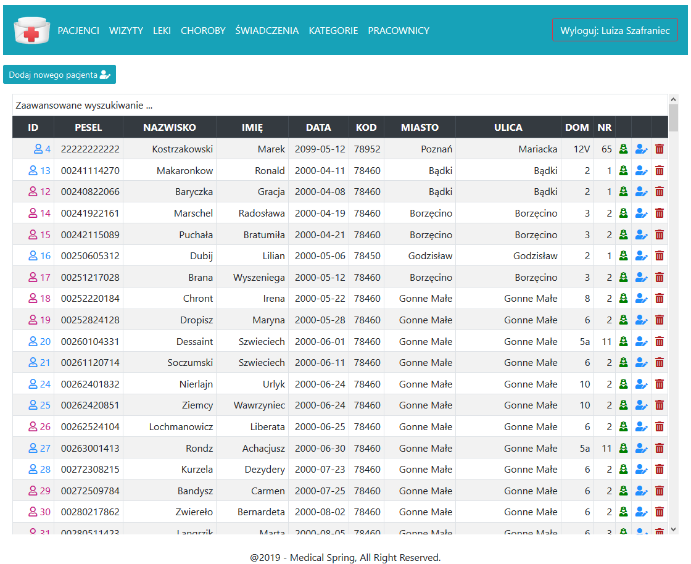
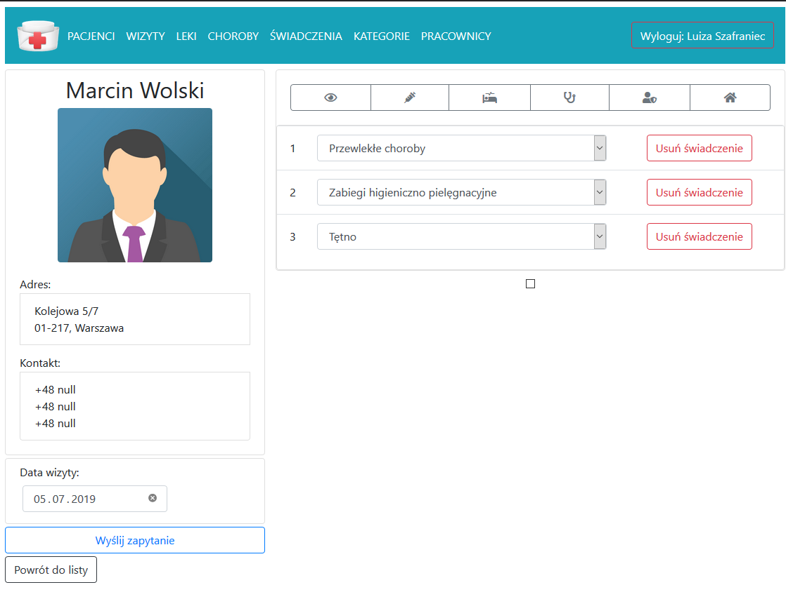

# Project Name
> # MEDICAL SPRING!

## Table of contents
* [General info](#general-info)
* [Features](#features)
* [Technologies](#technologies)
* [Setup](#setup)
* [Screenshots](#screenshots)
* [Status](#status)
* [Inspiration](#inspiration)
* [Contact](#contact)

## General info
Web application designed for nurses. It serves to improve planning and record environmental visits. It contains a comprehensive database of patients, has a wide range of search filters. It allows generating reports of medical services in given time intervals. This project was created using: Java Spring, MVC, Security, Thymeleaf and PostgresSQL.

## Features
List of features ready:
* store patients data, pesel, adres, diseases, medicines contacts in a local database (PostgreSQL)
* allows you to record completed visits
* allow planing new vists with details
### TO DO
* create the statistics, raports
* notification panel
* prints of patient cards, visits

## Technologies
* Java with Spring
* Spring Boot
* Spring Data, Spring Security
* HTML, CSS, Bootstrap
* SQL
* Lombook
* Thymeleaf

## Setup
Use Maven to download all nedeed dependencies, run the main class. 
There are plans to uplod the project on the web

## Screenshots

## Status
Project is: _in progress_ : 07.07.2019

## Inspiration
Project inspired by willingness to help nurses in a small town in Zachodniopomorskie.

## Contact
Created by [Kamil Woś](mailto:inz.kamil.wos@gmail.com) & [Bartosz Dziedzic](mailto:bartosz.dziedzic94@gmail.com)
- feel free to contact us!
